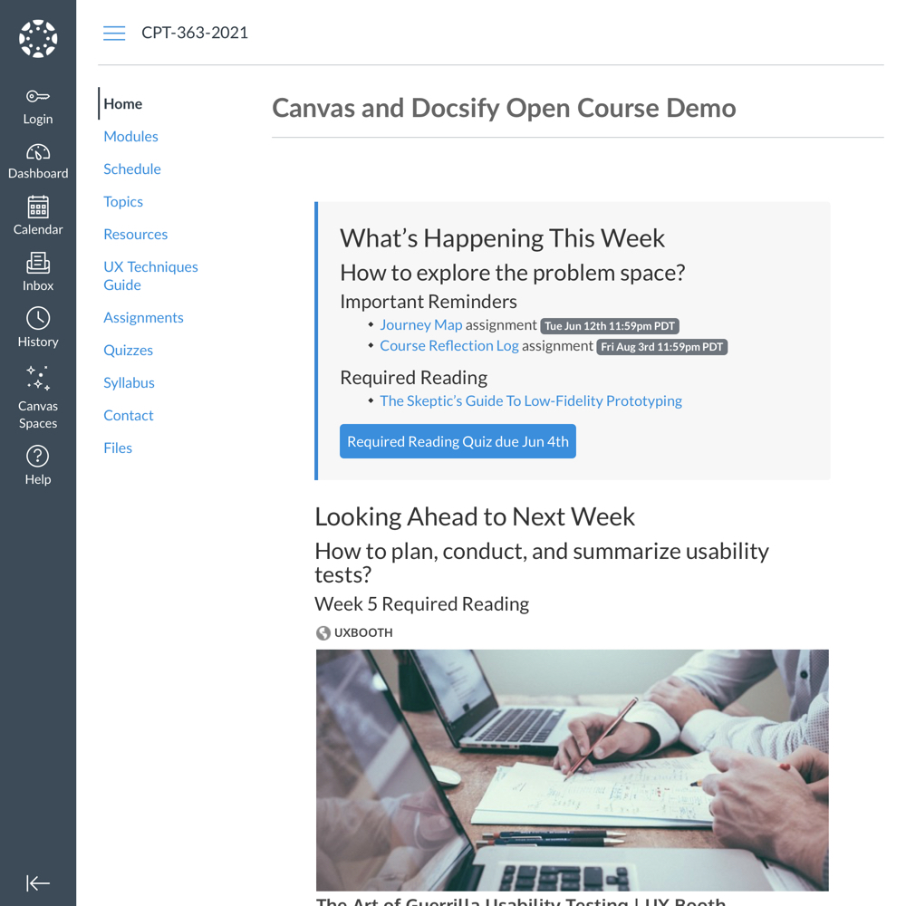

# Docsify Open Course Starter Kit Local

> This is a starter kit to quickly create a Markdown-based open course site with the site generator [Docsify](https://docsify.js.org). To address possible privacy/GDPR concerns all needed css/js files are loaded locally and not via CDN (thanks to [@mandrasch](https://github.com/mandrasch) for the suggestion).

📸 Docsify Open Course Screenshot
---

_Figure 1. Docsify Open Course Starter Kit. Explore a demo at [hibbitts-design.github.io/demo-docsify-open-course-starter-kit/](https://hibbitts-design.github.io/demo-docsify-open-course-starter-kit/#/)_

🚀 GitHub Pages Quickstart
---
**Pre-flight Checklist**  

1. GitHub account

**Installation and Deployment**

1. Tap **Use this template** on the source repository (upper-right green button)
2. Choose the name for your new repository to contain the copied site files and then tap **Create repository from template**
3. Go to **Settings** of your newly created repository, tap the **Pages** tab (on the left-hand side), choose **main branch**, then **docs folder** and finally tap the **Save** button (see more details in the [Docsify documentation](https://docsify.js.org/#/deploy?id=github-pages))
4. And you're done! (view your new site using the provided URL on the **Pages** tab - it can take up to 20 minutes for your site to be initially available)

[View these instructions with accompanying screenshots.](https://github.com/hibbitts-design/docsify-open-course-starter-kit/wiki/Installation-and-Deployment-Guide)

**Editing Your Docsify Site Pages on GitHub**

1. Go to the Docsify Markdown (.md) page in the `docs` folder of your repository you want to edit
2. Tap the **Pencil Icon** (top left-hand toolbar area) to start the editor
3. Scroll down to the bottom of the page and tap the **Commit changes** button to save your changes

[Learn more about creating pages in Docsify.](https://docsify.js.org/#/more-pages)

📝 Activating the “Edit this Page” Link
---   

1. At the top-level of your GitHub Repository, copy the URL and then tap on the `docs` folder
2. Tap on the file `index.html` within the `docs` folder 
3. Tap the **Pencil Icon** (top left-hand toolbar area) to start the editor
4. Find the line `var yourRepoURL = '';` and enter the URL of your own GitHub Repository in between the two quotes and then scroll down to the bottom of the page and tap the **Commit changes** button to save your changes

[View these instructions with accompanying screenshots.](https://github.com/hibbitts-design/docsify-open-course-starter-kit/wiki/Activating-the-Edit-this-Page-Link-Guide)

💻 Locally Editing your Docsify Site Pages
---  

**Editing Your Docsify Site Pages on Your Desktop**
1. Tap **Clone** on your repository page
2. Choose **Open Desktop** and follow the prompts, installing [GitHub Desktop](https://desktop.github.com/) if not already present
3. You will now be able to edit your Docsify site (in the `docs` folder) using the desktop editor of your choice (e.g. atom.io)
4. Use GitHub Desktop to push any changes to your repository.  

[Learn more about using GitHub Desktop](https://help.github.com/en/desktop/contributing-to-projects/committing-and-reviewing-changes-to-your-project).

You can also clone (i.e download) a copy of your repository to your computer and [run Docsify locally](https://docsify.js.org/#/quickstart) to preview your site. See the below video for details.

Do you use GitLab? You can also use Docsify with [GitLab Pages](https://docsify.js.org/#/deploy?id=gitlab-pages)!

🧩 Embedding Docsify Page Content into Other Systems
---  

_Figure 2. Docsify Open Course Page Embedded into the Canvas LMS. Explore an example Canvas LMS course using Docsify Open Course pages for content at [https://canvas.sfu.ca/courses/44038/](https://canvas.sfu.ca/courses/44038)_

The optional ‘embedded’ (all lowercase) URL parameter hides a site’s sidebar and optional navbar for seamlessly embedding Docsify page content within another platform such as Canvas LMS, Moodle, Microsoft Teams etc.

To only display Docsify page content, add the following to a Docsify page URL:

`?embedded=true`

For example, https://hibbitts-design.github.io/demo-docsify-open-course-starter-kit/#/resources would display a standard Docsify page while https://hibbitts-design.github.io/demo-docsify-open-course-starter-kit/#/resources?embedded=true would only display page content (i.e. no sidebar or optional navbar is shown).

To optionally hide the 'Edit this Page' link, use the following:

`?embedded=true&hidegitlink=true`

For example, https://hibbitts-design.github.io/demo-docsify-open-course-starter-kit/#/resources would display a standard Docsify page while https://hibbitts-design.github.io/demo-docsify-open-course-starter-kit/#/resources?embedded=true&hidegitlink=true would only display page content (i.e. no sidebar or optional navbar is shown) and also hide the 'Edit this Page' link.

🌐 Using an LMS to Host a Docsify Open Course Site
---

As Docsify Open Course Starter Kit does not require a web server, it can actually be hosted on many LMSs that support file libraries such as Canvas and Moodle.

For example, here is a [Docsify Open Course Site hosted within a Canvas course](https://canvas.sfu.ca/courses/44038/files/15884796/download) and here is a [Docsify Open Course Site hosted within a Moodle course](https://paulhibbitts.net/moodle/mod/resource/view.php?id=25). Single Docsify Open Course site pages can also be embedded while hosted on the same system.

**Hosting a Docsify Open Course Site on your LMS**
1. Tap **Download** on your repository page
2. Upload to your LMS file storage area, and unzip the upload file
3. Based on your LMS, determine the external URL required to load the `index.html` file within the Docsify `Docs` folder. In Canvas, an example URL would look similar to `https://canvas.sfu.ca/courses/44038/files/15884796/download`.

| :warning: | Once hosted within your LMS, changes made to the source GitHub repository are no longer automatically reflected on your hosted Docsify site. Any GitHub repository updates must be manually uploaded to the LMS file library area. |
|---|:--|

📚 Docsify and Markdown Resources
---
**Docsify**  
[Docsify Documentation](https://docsify.js.org/#/?id=docsifyg)  
[Docsify Basics by MichaelCurrin](https://michaelcurrin.github.io/docsify-js-tutorial/#/?id=docsify-basics)  

**Markdown**  
[Markdown Cheat Sheet](https://warpedvisions.org/projects/markdown-cheat-sheet/)  
[Markdown Guide](https://www.markdownguide.org/)  

📼 Video Walkthrough of Local Docsify Install/Config
---
  
_Video 1. Generating Documentation Sites with GitHub and Docsify - Alysson Alvaran_

🙇‍Credits and Special Thanks
---
[Docsify Themeable](https://github.com/jhildenbiddle/docsify-themeable)  
